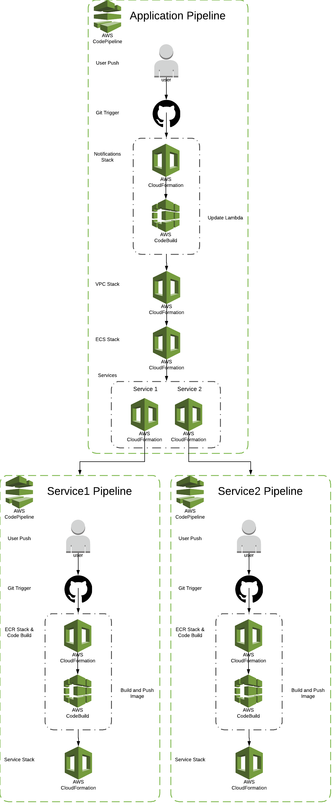

# Services CI/CD Stack
Create an ECS Microservices stack with built-in CI/CD for the Infrastructure (IaC) and Code.

## Architecture

## CI/CD CodePipelines

## Setup
1. Fork and clone this repo.
2. Fork and clone the [service1-stack-cicd](https://github.com/thestackshack/service1-stack-cicd)
3. Install [CIM](https://github.com/thestackshack/cim) (CloudFormation Utility)
4. Install the [kms](kms/README.md) stack.
5. Create an EC2 keypair.
6. Install the [bootstrap.stack.yml](bootstrap.stack.yml) stack.

## Encrypt Secrets
In order to protect your configuration secrets like your GitHub token we need to create a KMS key first.

You can use the CloudFormation script in [kms](kms/README.md) or just create it via the console.

## EC2 Keypair
Use the console to create an EC2 keypair for all your EC2 instances.

## Stack Up
Create the [bootstrap.stack.yml](bootstrap.stack.yml) stack.  

First update [_cim.yml](_cim.yml) with your GitHub information and your EC2 keypair.  

Also take a look at the [vpc parameters](stacks/vpc/_cim.yml).  You might need to change the AvailabilityZones. 

This stack will build 2 pipelines:

1. Prod (master branch)
2. Sandbox (develop branch)

Each pipeline will execute the following steps every time you commit changes to this repo:

- Create/Update the [stacks/vpc.stack.json](stacks/vpc/vpc.stack.json) stack.
- Create/Update the [stacks/ecs.stack.yml](stacks/ecs.stack.yml) stack.
- Create/Update the [stacks/service1.bootstrap.stack.yml](stacks/service1.stack.yml) stack.

The [stacks/service1.bootstrap.stack.yml](stacks/service1.stack.yml) stack creates a pipeline that 